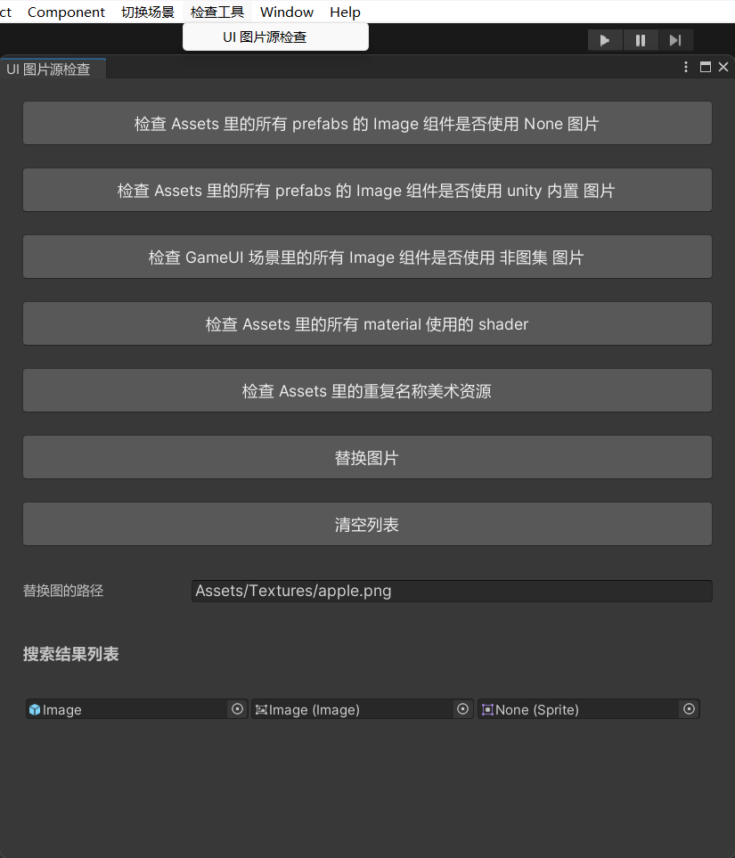
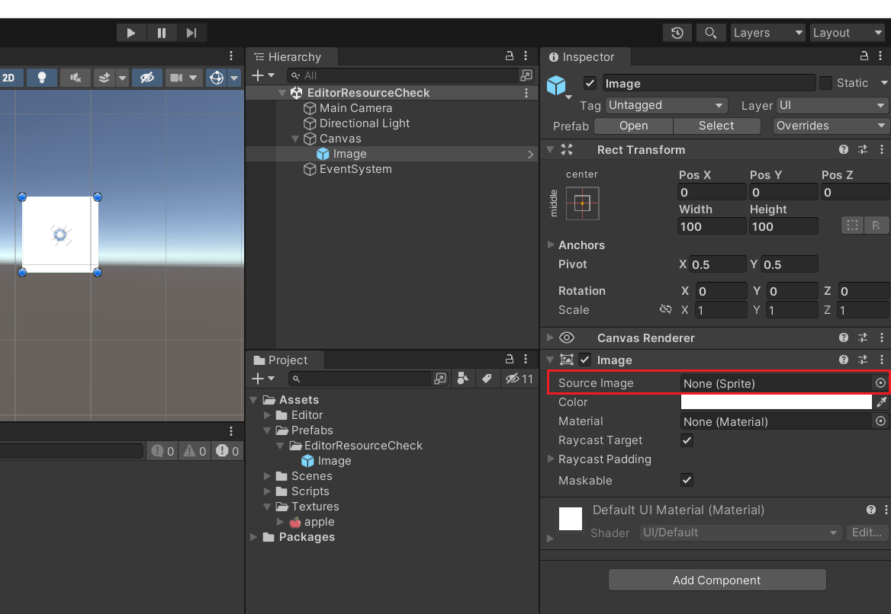
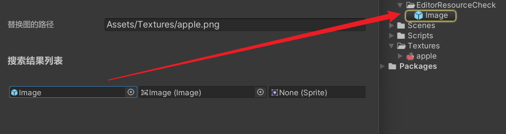

# UI 图片源检查工具

这是一个批量检查 UI prefab 中的 Image 组件图片源的工具。

如图所示，上方的按钮显示了该按钮所对应的功能，下方展示了搜索结果。





上图的搜索结果，是点击了第一个按钮的效果，可以遍历 Assets 文件夹里面的所有 prefab，并且检查到了有 Image 组件的图片源是 None。

如果点击<kbd>替换图片</kbd>按钮，会根据替换图路径，读取本地图片，对搜索结果列表中的 Image 组件的 Source Image 属性进行修改。




下面是该按钮功能的一部分代码展示。

使用 Linq 的 Where 方法进行查找，找到所有以 prefab 扩展名结尾的文件，得到一组文件路径字符串。

遍历所有路径字符串，使用 AssetDatabase.LoadAssetAtPath 加载资源实例，获取 Image 组件。

使用 AssetDatabase.GetAssetPath 获取 Image 组件的 sprite 路径，判断路径是否为空。

符合条件的 Prefab，会被存储到 Node 节点中，并继续创建链表节点，链接 Image 和 Sprite，存入搜索结果列表中。

```c#
using System.Collections.Generic;
using System.IO;
using System.Linq;

using UnityEngine;
using UnityEngine.UI;
using UnityEngine.U2D;
using UnityEditor;

public class EditorResourceCheck : EditorWindow
{
    // ...
    
    /// <summary>
    /// 检查 Assets 里的所有 prefabs 的 Image 组件是否使用 None 图片
    /// </summary>
    static void CheckNoneSprite()
    {
        // 查找路径，Assets 下的所有文件
        string path = "Assets/";
        // 查找所有 .prefab 文件，存储文件路径
        var allfiles = Directory.GetFiles(path, "*.*", SearchOption.AllDirectories)
            .Where(s => s.EndsWith("prefab")).ToArray();
        // 遍历所有 prefab 的路径列表
        foreach (var item in allfiles)
        {
            // 通过资源路径加载 GameObject
            GameObject go = AssetDatabase.LoadAssetAtPath<GameObject>(item);
            if (go)
            {
                // 获取 Image 数组（包括未启用的），预防多个 Image 的情况
                Image[] images = go.GetComponentsInChildren<Image>(true);
                // 遍历该预制体上的所有 Image 组件
                foreach (var img in images)
                {
                    // 获取图片源路径
                    string spritePath = AssetDatabase.GetAssetPath(img.sprite);
                    if (spritePath.Equals(string.Empty))
                    {
                        Node node = new Node(go, "prefab");
                        node.Add(img, "image").Add(img.sprite, "sprite");
                        res.Add(node);
                    }
                }
            }
        }

        nodeWidth = 200;

        if (res.Count == 0)
        {
            EditorUtility.DisplayDialog("温馨提示", "没有符合条件的图片", "okk");
        }
    }
    
    // ...
}
```


上文提到的 Node 节点代码如下。

```c#
/// <summary>
/// 链表节点
/// </summary>
public class Node
{
    public UnityEngine.Object data;    // 链表数据
    public string type;                // 链表类型
    public Node next;                  // 链表指针

    public Node(UnityEngine.Object data, string type)
    {
        this.data = data;
        this.type = type;
    }

    /// <summary>
    /// 链表尾插法
    /// </summary>
    /// <param name="data">链表数据</param>
    public Node Add(UnityEngine.Object data, string type)
    {
        Node node = new Node(data, type);
        this.next = node;
        return node;
    }
}
```


窗口会把搜索结果列表的内容渲染到滚动视图中，每一条数据都是链表的形式，展示了 Prefab、Image、Sprite 三个资源，并且可以点击快速定位到资源。

```c#
public class EditorResourceCheck : EditorWindow
{
    // ...
    
    /// <summary>
    /// 绘制窗口
    /// </summary>
    void OnGUI()
    {
        // ...
        
        // 绘制滚动视图
        scrollPos = EditorGUILayout.BeginScrollView(scrollPos, scrollViewStyle);
        EditorGUILayout.BeginVertical();

        // 绘制查询到的预制体和图片组件节点
        foreach (var item in res)
        {
            EditorGUILayout.BeginHorizontal();
            DrawNextNode(item);
            EditorGUILayout.EndHorizontal();
        }

        EditorGUILayout.EndVertical();
        EditorGUILayout.EndScrollView();
    }
    
    /// <summary>
    /// 递归绘制节点
    /// </summary>
    /// <param name="node">节点</param>
    static void DrawNextNode(Node node)
    {
        EditorGUILayout.ObjectField(node.data, node.data.GetType(), true, GUILayout.Width(nodeWidth));
        if (node.next != null)
        {
            DrawNextNode(node.next);
        }
    }
    
    // ...
}
```


