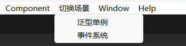

# 菜单栏快速切换场景

一般要打开一个场景，需要在 Assets 文件夹下找到场景文件，双击打开。

但是当资源文件夹太多，搜索起来也比较麻烦。

下面的脚本提供一个快速打开场景的方案，可以在顶部菜单栏上显示几个按钮，点击即可切换到想要的场景。

切换场景时会提示是否要保存当前场景的修改内容，不必担心会丢失修改。

图例：



代码：

```c#
using UnityEditor;
using UnityEditor.SceneManagement;

public static class EditorSwitchScene
{
    /// <summary>
    /// 打开场景
    /// </summary>
    /// <param name="filename">场景路径</param>
    public static void OpenScene(string filename)
    {
        // 询问是否保存对当前场景的修改
        if (EditorSceneManager.SaveCurrentModifiedScenesIfUserWantsTo())
        {
            EditorSceneManager.OpenScene(filename);
        }
    }

    [MenuItem("切换场景/泛型单例")]
    public static void SwitchSingleton()
    {
        OpenScene("Assets/Scenes/Singleton.unity");
    }

    [MenuItem("切换场景/事件系统")]
    public static void SwitchEvent()
    {
        OpenScene("Assets/Scenes/Event.unity");
    }
}
```

